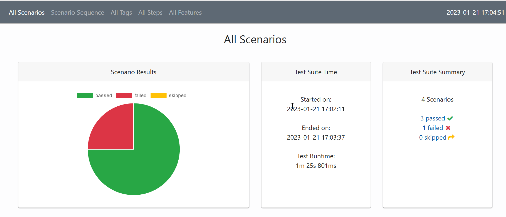

# UI_Automation_BDD_POM_Framework

# Selenium + BDD Cucumber framework
# Support Parallel execution using TestNG

#**Steps to run the test suite**
1. Clone the repo
2. Go to directory "UI_Automation_BDD_POM_Framework"
3. Run mvn clean test command in terminal. 

**To Generate HTML Report with Test Results:**
Run below command in the terminal at root directory of project.
mvn cluecumber-report:reporting

Report will be generated at below location.
UI_Automation_BDD_POM_Framework/target/generated-report

Open index.html file
Sample Report:
